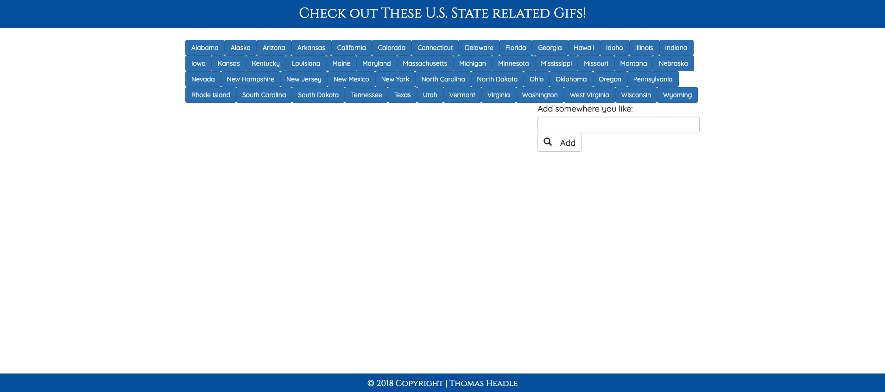

# Giphy API State Generator

[Live Site](https://tgheadle1371.github.io/giphyAPI/)

## Overview:

-   This simple app pre-populates the DOM with an array of buttons + topics that will access the top 10 gifs returned for that search term with Giphy.
-   Gifs are displayed initially as still images that will animate on click.
-   Each user can add as many additional buttons of their choice as they wish.

### To Begin

1. Click a State
2. Click on the Input Box and add anything you want!

## Technologies used:

-   HTML5
-   CSS3
-   JavaScript
-   jQuery
-   [Bootstrap](https://getbootstrap.com/docs/4.1/getting-started/introduction/)
-   [Giphy API](https://developers.giphy.com/)

